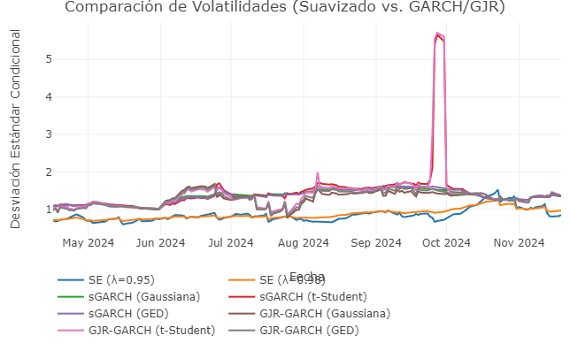
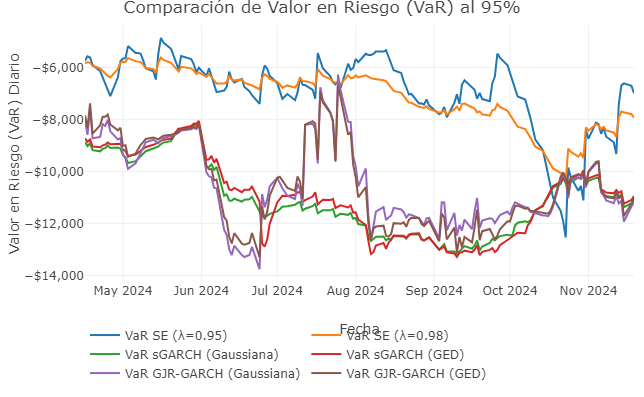

# TAREA DE PROGRAMACIÓN DE MODELO GARCH

Hecho por:

-   Francisco Alvarez Aguilera[^1]

[^1]: 1911217e\@umich.mx

**Universidad Michoacana de San Nicolás de Hidalgo**

{width="20%"}

**Licenciatura en Actuaría y Ciencia de Datos**

{width="30%"}

## Introducción

La volatilidad es uno de los conceptos fundamentales para el análisis cuantitativo de series financieras como acciones, rendimientos, etcétera, pues representa una medida de la incertidumbre asociada a los rendimientos o variaciones de una variable aleatoria en el tiempo. Para nosotros como estudiantes de actuaría podría ser importante en ámbitos como la valuación de activos, la gestión integral de riesgos y las pruebas de solvencia dinámica, la estimación adecuada de la volatilidad es crucial para una medición realista del riesgo.

A lo largo del tiempo se han desarrollado diversos métodos para estimar la volatilidad, los cuales difieren principalmente en los supuestos que realizan sobre su comportamiento temporal. Este ensayo presenta y discute tres enfoques ampliamente utilizados: la volatilidad convencional o constante, la volatilidad con suavizamiento exponencial y la volatilidad modelada mediante procesos GARCH. Se analizan sus propiedades teóricas y prácticas, poniendo especial énfasis en el fenómeno conocido como *conglomerado de volatilidades*.

## Desarrollo

### Volatilidad convencional o fija en el tiempo

La volatilidad convencional asume que la varianza de los rendimientos permanece constante a lo largo del tiempo. Bajo este supuesto, la volatilidad se estima mediante la desviación estándar muestral de los rendimientos ( r_t ), definida como:

$$
\sigma = \sqrt{\frac{1}{T-1}\sum_{t=1}^{T}(r_t - \bar{r})^2}
$$

donde ( $\bar{r}$ ) representa el rendimiento promedio y ( T ) el número total de observaciones.

Desde una perspectiva teórica, este enfoque descansa en el supuesto de homocedasticidad, el cual rara vez se cumple en series financieras reales. En la práctica, su principal ventaja radica en su simplicidad y facilidad de interpretación, lo que lo hace útil como medida descriptiva o como punto de referencia inicial. Sin embargo, su limitación más importante es que ignora por completo la dinámica temporal del riesgo, lo que conduce a una subestimación del riesgo en periodos de alta volatilidad y a una sobrestimación en periodos de estabilidad.

### Volatilidad con suavizamiento exponencial

La volatilidad con suavizamiento exponencial introduce dependencia temporal asignando mayor peso a las observaciones más recientes. Una formulación común de este enfoque es:

$$
\sigma_t^2 = \lambda \sigma_{t-1}^2 + (1 - \lambda) r_{t-1}^2
$$

donde ( 0 \< $\lambda$ \< 1 ) es el parámetro de suavizamiento que controla la velocidad de ajuste de la volatilidad.

Teóricamente, este método reconoce que la información más reciente es más relevante para la estimación del riesgo actual. En términos prácticos, permite capturar cambios graduales en la volatilidad y responde con mayor rapidez a choques recientes que la volatilidad constante. No obstante, el valor del parámetro ( $\lambda$ ) suele fijarse de manera arbitraria y el modelo no define un proceso aleatorio completo para los rendimientos. Este tema de elegir el parámetro arbitrariamente es algo que corrige el siguiente modelo de volatilidad.

### Volatilidad GARCH

Los modelos GARCH (Generalized Autoregressive Conditional Heteroskedasticity) proporcionan una formulación econométrica explícita para la volatilidad condicional. El modelo GARCH(1,1), ampliamente utilizado en la práctica, se define como:

$$
\sigma_t^2 = \omega + \alpha r_{t-1}^2 + \beta \sigma_{t-1}^2
$$

con las restricciones ( $\omega$ \> 0 ), ( $\alpha \geq$ 0 ), ( $\beta \geq$ 0 ) y ( $\alpha + \beta$ \< 1 ).

Desde el punto de vista teórico, este enfoque modela explícitamente la heterocedasticidad condicional y explica de forma natural el comportamiento dinámico de la volatilidad. En la práctica, los modelos GARCH permiten estimaciones más realistas del riesgo y son ampliamente utilizados en valuación de activos, gestión de riesgos y análisis regulatorio. Su principal desventaja es la mayor complejidad computacional y la necesidad de realizar estimaciones paramétricas, así como la sensibilidad a los supuestos sobre la distribución de los errores.

Para ver mas acerca de los modelos de volatilidad anteriormente mencionados podemos revisar las notas utilizadas en clase y especificamente la presentación: "**Medición de la volatilidad como insumo del VaR y el CVaR"**{<https://oscarvdelatorretorres.github.io/materias/01Actuaria/03admonRiesgos/02ModelosDeVolatilidad/#/title-slide>}

### El conglomerado de volatilidades

El *conglomerado de volatilidades* (*volatility clustering*) es un fenómeno empírico que describe la tendencia de los periodos de alta volatilidad a agruparse entre sí, al igual que los periodos de baja volatilidad. En otras palabras, grandes variaciones en los rendimientos tienden a ser seguidas por grandes variaciones, y pequeñas variaciones por pequeñas variaciones, independientemente del signo.

Este comportamiento contradice el supuesto de varianza constante y justifica el uso de modelos dinámicos. Mientras que la volatilidad convencional ignora completamente este fenómeno, el suavizamiento exponencial lo captura de forma implícita, y los modelos GARCH lo incorporan de manera explícita y estructural dentro de su formulación.

## Conclusión

La estimación de la volatilidad es un componente esencial en el análisis cuantitativo del riesgo. La volatilidad convencional, aunque simple y fácil de implementar, resulta inadecuada en contextos donde la variabilidad del riesgo cambia en el tiempo. La volatilidad con suavizamiento exponencial representa un modelo intuitivo al introducir memoria temporal (con el $\lambda$ arbitrario), aunque carece de una estructura probabilística formal. Por su parte, los modelos GARCH ofrecen una representación más completa y realista de la dinámica de la volatilidad, capturando explícitamente el fenómeno de conglomerados de volatilidad.

En aplicaciones prácticas donde la medición precisa del riesgo es crítica, como en la gestión financiera y actuarial, los modelos dinámicos de volatilidad constituyen herramientas indispensables. La elección del modelo adecuado debe balancear simplicidad, interpretabilidad y realismo, considerando siempre el objetivo específico del análisis.

# ANÁLISIS CUANTITATIVO

```{r}
# Liberías de yahoo finance de Github:
source("https://raw.githubusercontent.com/OscarVDelatorreTorres/yahooFinance/main/datosMultiplesYahooFinance.R")
# Librerías de cuantificación de riesgos en Github:
source("https://raw.githubusercontent.com/OscarVDelatorreTorres/riskManagementSuiteR/refs/heads/main/riskManagementSuiteFunctions.R")
# Librerías de uso general:
library(plotly)
library(dplyr)
library(tseries)
library(quantmod)
library(tidyverse)
library(tibble)
library(forecast)
library(DT)
library(rugarch)
```

Comenzamos: "La serie de tiempo debe ser de periodicidad diaria del 20 de noviembre de 2023 al 20 de noviembre de 2024 para este análisis puntual al 20 de noviembre de 2024."

```{r}
# Identificador:
tickerV=c("QQQ")
# Fecha desde empleando la fecha actual menos 500 días:
deD="2023-11-20"
# Fecha hasta, empleando la fecha actual en el sistema:
hastaD="2024-11-20"
# Definiendo la periodicidad de los datos:
per="D"
paridadFX="USDMXN=X"
convertirFX=c(TRUE)

Datos=historico_multiples_precios(tickers=tickerV,de=deD,hasta=hastaD,periodicidad=per,fxRate=paridadFX,whichToFX=convertirFX)
precios=Datos$tablaPrecios
rendimientos=Datos$tablaRendimientosCont

```

"Posteriormente debe hacer un análisis cuantitativo del mejor ajuste de los 3 tipos de volatilidad con los rendimientos continuamente compuestos de una inversión de \$500,000.00 en el fondo QQQ (valuado en pesos mexicanos).

Para probar el beneficio, para ese caso particular de ese fondo, debe calcular las siguientes volatilidades:

1.  Fija en el tiempo o convencional.

2.  Con suavizamiento exponencial y parámetro lambda de 0.95

3.  Con suavizamiento exponencial y parámetro lambda de 0.98

4.  GARCH simétrico con función de verosimilitud gaussiana.

5.  GARCH simétrico con función de verosimilitud t-Student.

6.  GARCH simétrico con función de verosimilitud GED.

7.  GJR-GARCH (asimétrico) con función de verosimilitud gaussiana.

8.  GJR-GARCH (asimétrico) con función de verosimilitud t-Student.

9.  GJR-GARCH (asimétrico) con función de verosimilitud GED.

Determine, empleando el criterio de información de Akaike (función AIC), cuál es el que mejor ajusta a los largo de toda la serie de tiempo."

## Volatilidad fija en el tiempo o convencional.

```{r}
sigmas=sd(rendimientos[,2])
sigmas
```

## Volatilidad con suavizamiento exponencial

### Con suavizamiento exponencial y parámetro lambda de 0.95

```{r}
lambda1 = 0.95
pesos=lambda1^(0: (nrow(rendimientos)-1))
varExp1=(1-lambda1)*sum(pesos*(rendimientos[,2]^2))
volExp1 = sqrt(varExp1)
volExp1
```

### Con suavizamiento exponencial y parámetro lambda de 0.98

```{r}
lambda2 = 0.98
pesos=lambda2^(0: (nrow(rendimientos)-1))
varExp2=(1-lambda2)*sum(pesos*(rendimientos[,2]^2))
volExp2 = sqrt(varExp2)
volExp2
```

## Volatilidad GARCH

### GARCH simétrico con función de verosimilitud gaussiana.

```{r}
# 1. GARCH(1,1) / Gaussiana (Norm)
spec_garch_norm = ugarchspec(
    variance.model = list(model = 'sGARCH', garchOrder = c(1, 1)),
    distribution.model = 'norm')
fit_garch_norm = ugarchfit(spec_garch_norm, data = rendimientos[,2])
    
```

### GARCH simétrico con función de verosimilitud t-Student.

```{r}
# 2. GARCH(1,1) / t-Student (Std)
spec_garch_std <- ugarchspec(
    variance.model = list(model = 'sGARCH', garchOrder = c(1, 1)),
    distribution.model = 'std'
)

fit_garch_std  <- ugarchfit(spec_garch_std, data = rendimientos[,2])
```

### GARCH simétrico con función de verosimilitud GED.

```{r}
# 3. GARCH(1,1) / GED
spec_garch_ged <- ugarchspec(
    variance.model = list(model = 'sGARCH', garchOrder = c(1, 1)),
    distribution.model = 'ged'
)

fit_garch_ged  <- ugarchfit(spec_garch_ged, data = rendimientos[,2])
```

### GJR-GARCH (asimétrico) con función de verosimilitud gaussiana.

```{r}
# 4. GJR-GARCH(1,1) / Gaussiana (Norm)
spec_gjr_norm <- ugarchspec(
    variance.model = list(model = 'gjrGARCH', garchOrder = c(1, 1)),
    distribution.model = 'norm'
)

fit_gjr_norm   <- ugarchfit(spec_gjr_norm, data = rendimientos[,2])
```

### GJR-GARCH (asimétrico) con función de verosimilitud t-Student.

```{r}
# 5. GJR-GARCH(1,1) / t-Student (Std)
spec_gjr_std <- ugarchspec(
    variance.model = list(model = 'gjrGARCH', garchOrder = c(1, 1)),
    distribution.model = 'std'
)

fit_gjr_std    <- ugarchfit(spec_gjr_std, data = rendimientos[,2])
```

### GJR-GARCH (asimétrico) con función de verosimilitud GED.

```{r}
# 6. GJR-GARCH(1,1) / GED
spec_gjr_ged <- ugarchspec(
    variance.model = list(model = 'gjrGARCH', garchOrder = c(1, 1)),
    distribution.model = 'ged'
)

fit_gjr_ged    <- ugarchfit(spec_gjr_ged, data = rendimientos[,2])
```

## Análisis volatilidades

Primero debemos comparar todos los resultados obtenidos para los distintos tipos de volatilidad. Creamos una tabla que comprenda a todas estas para después graficar, para esto debemos aplicar las funciones rollGARCH( ) y rollEWSigma( ) a los casos pertinentes.

```{r, eval=FALSE}

suavExponMovil95=rollEWSigma(rendimientos$QQQ,lambda=0.95,ventana=100)

suavExponMovil98=rollEWSigma(rendimientos$QQQ,lambda=0.98,ventana=100)

garchMovil1=rollGARCH(rendimientos$QQQ,model="sGARCH",LLF="norm",garchOrder=c(1,1),ventana=100,arma=c(0,0),include.mean = FALSE,upDown=TRUE)

garchMovil2=rollGARCH(rendimientos$QQQ,model="sGARCH",LLF="std",garchOrder=c(1,1),ventana=100,arma=c(0,0),include.mean = FALSE,upDown=TRUE)

garchMovil3=rollGARCH(rendimientos$QQQ,model="sGARCH",LLF="ged",garchOrder=c(1,1),ventana=100,arma=c(0,0),include.mean = FALSE,upDown=TRUE)

garchMovil4=rollGARCH(rendimientos$QQQ,model="gjrGARCH",LLF="norm",garchOrder=c(1,1),ventana=100,arma=c(0,0),include.mean = FALSE,upDown=TRUE)

garchMovil5=rollGARCH(rendimientos$QQQ,model="gjrGARCH",LLF="std",garchOrder=c(1,1),ventana=100,arma=c(0,0),include.mean = FALSE,upDown=TRUE)

garchMovil6=rollGARCH(rendimientos$QQQ,model="gjrGARCH",LLF="ged",garchOrder=c(1,1),ventana=100,arma=c(0,0),include.mean = FALSE,upDown=TRUE)

```

Recopilamos en una tabla:

```{r, eval=FALSE}
tablaVolatilidades=data.frame(Fecha=rendimientos$Date,
           Volatilidad_SE_95=suavExponMovil95,
           Volatilidad_SE_98=suavExponMovil98,
           Volatilidad_sGARCH_norm=garchMovil1,
           Volatilidad_sGARCH_std=garchMovil2,
           Volatilidad_sGARCH_ged=garchMovil3,
           Volatilidad_gjrGARCH_norm=garchMovil4,
           Volatilidad_gjrGARCH_std=garchMovil5,
           Volatilidad_gjrGARCH_ged=garchMovil6
           ) 
```

Graficamos:

```{r, eval=FALSE}
# Definición del objeto de gráfico inicial
grafico_volatilidades_addtrace <- plot_ly() %>%
    layout(
        title = "Comparación de Volatilidades (Suavizado vs. GARCH/GJR)",
        xaxis = list(title = "Fecha"),
        yaxis = list(title = "Desviación Estándar Condicional"),
        legend = list(orientation = 'h', x = 0, y = -0.15)
    )

# Añadimos las 9 trazas de volatilidad por partes con add_trace()

# --- Volatilidades por Suavizado Exponencial (SE) ---
grafico_volatilidades_addtrace <- grafico_volatilidades_addtrace %>%
    add_trace(
        data = tablaVolatilidades,
        x = ~Fecha,
        y = ~Volatilidad_SE_95,
        type = "scatter",
        mode = "lines",
        name = "SE (λ=0.95)"
    ) %>%
    add_trace(
        data = tablaVolatilidades,
        x = ~Fecha,
        y = ~Volatilidad_SE_98,
        type = "scatter",
        mode = "lines",
        name = "SE (λ=0.98)"
    )

# --- Volatilidades GARCH Simétrico (sGARCH) ---
grafico_volatilidades_addtrace <- grafico_volatilidades_addtrace %>%
    add_trace(
        data = tablaVolatilidades,
        x = ~Fecha,
        y = ~Volatilidad_sGARCH_norm,
        type = "scatter",
        mode = "lines",
        name = "sGARCH (Gaussiana)"
    ) %>%
    add_trace(
        data = tablaVolatilidades,
        x = ~Fecha,
        y = ~Volatilidad_sGARCH_std,
        type = "scatter",
        mode = "lines",
        name = "sGARCH (t-Student)"
    ) %>%
    add_trace(
        data = tablaVolatilidades,
        x = ~Fecha,
        y = ~Volatilidad_sGARCH_ged,
        type = "scatter",
        mode = "lines",
        name = "sGARCH (GED)"
    )

# --- Volatilidades GJR-GARCH Asimétrico ---
grafico_volatilidades_addtrace <- grafico_volatilidades_addtrace %>%
    add_trace(
        data = tablaVolatilidades,
        x = ~Fecha,
        y = ~Volatilidad_gjrGARCH_norm,
        type = "scatter",
        mode = "lines",
        name = "GJR-GARCH (Gaussiana)"
    ) %>%
    add_trace(
        data = tablaVolatilidades,
        x = ~Fecha,
        y = ~Volatilidad_gjrGARCH_std,
        type = "scatter",
        mode = "lines",
        name = "GJR-GARCH (t-Student)"
    ) %>%
    add_trace(
        data = tablaVolatilidades,
        x = ~Fecha,
        y = ~Volatilidad_gjrGARCH_ged,
        type = "scatter",
        mode = "lines",
        name = "GJR-GARCH (GED)"
    )

grafico_volatilidades_addtrace
```



Ahora se calcula el VaR con las volatilidaes de la gráfica anterior, empleando la funcion VaR:

```{r, eval=FALSE}
M = 500000

VaR_SE_95    = VaR(M=M, sigma=tablaVolatilidades$Volatilidad_SE_95/100, confidence=0.95, pdfFunct="norm", VaRt=1)

VaR_SE_98    = VaR(M=M, sigma=tablaVolatilidades$Volatilidad_SE_98/100, confidence=0.95, pdfFunct="norm", VaRt = 1)

VaR_sGARCH_norm = VaR(M=M, sigma=tablaVolatilidades$Volatilidad_sGARCH_norm/100, confidence=0.95, pdfFunct="norm", VaRt=1)

# VaR_sGARCH_std  = VaR(M=M, sigma=tablaVolatilidades$Volatilidad_sGARCH_std/100, confidence=0.95, pdfFunct="std", VaRt=1)

VaR_sGARCH_ged  = VaR(M=M, sigma=tablaVolatilidades$Volatilidad_sGARCH_ged/100, confidence=0.95, pdfFunct="ged", VaRt=1)

VaR_gjrGARCH_norm = VaR(M=M, sigma=tablaVolatilidades$Volatilidad_gjrGARCH_norm/100, confidence=0.95, pdfFunct="norm", VaRt=1)

# VaR_gjrGARCH_std  = VaR(M=M, sigma=tablaVolatilidades$Volatilidad_gjrGARCH_std/100, confidence=0.95, pdfFunct="std", VaRt=1)

VaR_gjrGARCH_ged  = VaR(M=M, sigma=tablaVolatilidades$Volatilidad_gjrGARCH_ged/100, confidence=0.95, pdfFunct="ged", VaRt=1)


```

```{r, eval=FALSE}
tablaVaR <- data.frame(
    Fecha = rendimientos$Date,
    
    # Modelos Originales
    VaR_SE_95 = VaR_SE_95,
    VaR_SE_98 = VaR_SE_98,
    
    # Modelos sGARCH (Simétrico)
    VaR_sGARCH_norm = VaR_sGARCH_norm,
    #VaR_sGARCH_std = VaR_sGARCH_std,
    VaR_sGARCH_ged = VaR_sGARCH_ged,
    
    # Modelos GJR-GARCH (Asimétrico)
    VaR_gjrGARCH_norm = VaR_gjrGARCH_norm,
    #VaR_gjrGARCH_std = VaR_gjrGARCH_std,
    VaR_gjrGARCH_ged = VaR_gjrGARCH_ged
)

```

Ahora graficamos el VaR en terminos monetarios y omitiendo los modelos distribuidos t-student, esto debido a problemas con la función VaR y la aplicación de la firma de esta al modelo.

```{r, eval=FALSE}

grafico_VaR_comparacion <- plot_ly() %>%
    layout(
        title = "Comparación de Valor en Riesgo (VaR) al 95%",
        xaxis = list(title = "Fecha"),
        yaxis = list(title = "Valor en Riesgo (VaR) Diario", tickformat = "$,.0f"), 
        legend = list(orientation = 'h', x = 0, y = -0.15)
    )

# Añadimos las trazas correspondientes 

# --- VaR por Suavizado Exponencial (SE) ---
grafico_VaR_comparacion <- grafico_VaR_comparacion %>%
    add_trace(
        data = tablaVaR,
        x = ~Fecha,
        y = ~VaR_SE_95,
        type = "scatter",
        mode = "lines",
        name = "VaR SE (λ=0.95)"
    ) %>%
    add_trace(
        data = tablaVaR,
        x = ~Fecha,
        y = ~VaR_SE_98,
        type = "scatter",
        mode = "lines",
        name = "VaR SE (λ=0.98)"
    )

# --- VaR sGARCH (Simétrico) ---
grafico_VaR_comparacion <- grafico_VaR_comparacion %>%
    add_trace(
        data = tablaVaR,
        x = ~Fecha,
        y = ~VaR_sGARCH_norm,
        type = "scatter",
        mode = "lines",
        name = "VaR sGARCH (Gaussiana)"
    ) %>%
    # Se omite VaR_sGARCH_std
    add_trace(
        data = tablaVaR,
        x = ~Fecha,
        y = ~VaR_sGARCH_ged,
        type = "scatter",
        mode = "lines",
        name = "VaR sGARCH (GED)"
    )

# --- VaR GJR-GARCH (Asimétrico) ---
grafico_VaR_comparacion <- grafico_VaR_comparacion %>%
    add_trace(
        data = tablaVaR,
        x = ~Fecha,
        y = ~VaR_gjrGARCH_norm,
        type = "scatter",
        mode = "lines",
        name = "VaR GJR-GARCH (Gaussiana)"
    ) %>%
    # Se omite VaR_gjrGARCH_std
    add_trace(
        data = tablaVaR,
        x = ~Fecha,
        y = ~VaR_gjrGARCH_ged,
        type = "scatter",
        mode = "lines",
        name = "VaR GJR-GARCH (GED)"
    )

grafico_VaR_comparacion
```


### Criterio de información de Akakike

Para determinar el modelo que mejor se ajusta a a lo largo de la serie de tiempo utilizaremos el criterio de información que se revisó durante el curso, este es el criterio de información de Akaike (función $AIC$).

Este criterio se basa en la idea de que un modelo que capta más información de la realidad estudiada es el que tiene la mayor verosimilitud.

Su lógica de cálculo es la de penalizar la complejidad del modelo con el número de parámetros $k$ que tiene. Es decir, si un modelo tiene más parámetros, es más complejo y, por lo tanto, se penaliza con un valor mayor en el criterio de información.

Contrario al empleo de la función $LLF$, el modelo que más informacion capta (mejor se ajusta a la realidad modelada) es el que tiene el **criterio de información más bajo** de los $M$ modelos comparados.

$AIC=−2⋅LLF+2⋅k$

```{r}
AIC.rugarch=function(object){
  k= length(object@fit$coef)
  llf=object@fit$LLH
  aic=(2*k)-(2*llf)
  return(aic)
}

AIC_comparativo = c( "GARCH norm" = AIC.rugarch(fit_garch_norm),
                     "GARCH std" = AIC.rugarch(fit_garch_std),
                     "GARCH ged" = AIC.rugarch(fit_garch_ged),
                     "GJR norm" = AIC.rugarch(fit_gjr_norm),
                     "GJR std" = AIC.rugarch(fit_gjr_std),
                     "GJR ged" = AIC.rugarch(fit_gjr_ged)
                     )

cat("El criterio de infomación de Akaike para los modelos son:\n\n")
AIC_comparativo
```

En base a los resultados del criterio de Akaike obtenemos que el modelo que **mejor** se ajusta a la serie a lo largo del tiempo es el modelo **GJR-GARCH (asimétrico) con función de verosimilitud t-Student**.
